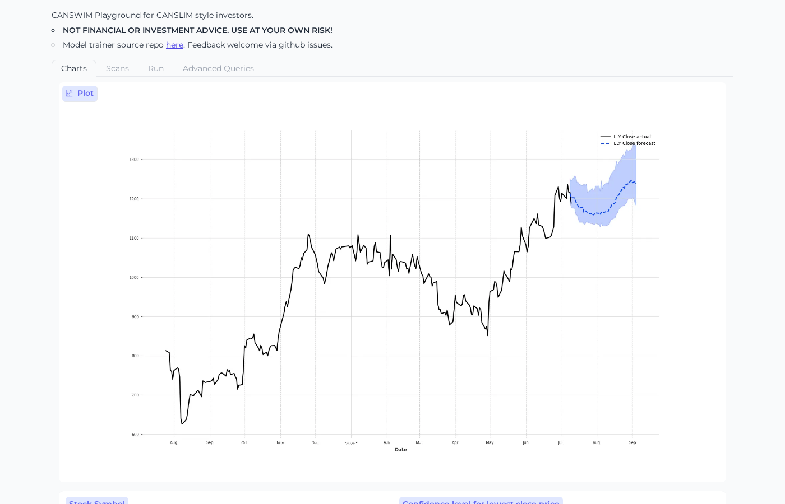
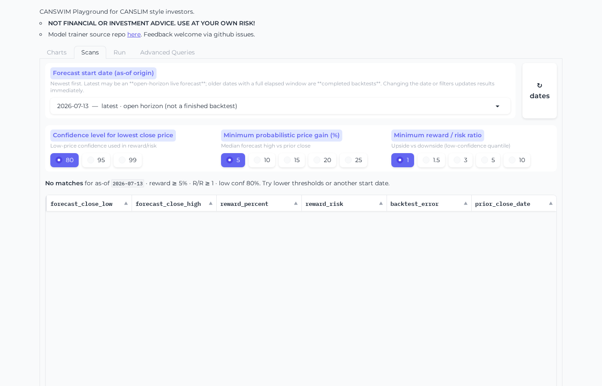
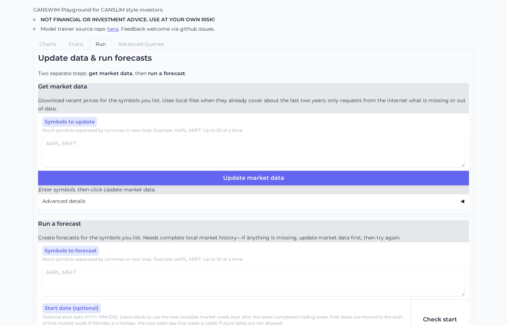

# canswim

Developer toolkit for CANSLIM investment style practitioners

**NOT FINANCIAL OR INVESTMENT ADVICE. USE AT YOUR OWN RISK.**

For a brief introduction read [this blog post](https://medium.com/@ivelin.atanasoff.ivanov/canswim-a-deep-learning-tool-for-canslim-practitioners-2c9740bb0d3d).

[Here is also a video recording](https://www.youtube.com/watch?v=GfC-H0uxXvk&ab_channel=AustinPythonMeetup) of a CANSWIM presentation for the [Python Austin Meetup](https://www.meetup.com/austinpython/).

## Documentation

**Published site:** [https://ivelin.github.io/canswim/](https://ivelin.github.io/canswim/) (built from `main` / `docs/` via GitHub Actions — not the legacy `website` branch).

| Doc | Contents |
|-----|----------|
| **[docs/cli.md](docs/cli.md)** | CLI tasks, recipes, env vars |
| **[docs/run_triggers.md](docs/run_triggers.md)** | Get market data / run forecast (CLI · GUI · MCP); stocks · IPOs · ETFs |
| **[docs/mcp.md](docs/mcp.md)** | MCP server (tools, opt-in writes, Streamable HTTP) |
| **[docs/deploy_service.md](docs/deploy_service.md)** | **Prod user systemd**: private Tailscale GUI + public apikey MCP |
| **[docs/data_store.md](docs/data_store.md)** | Parquet (SoT) vs DuckDB (search/UI) |
| **[AGENTS.md](AGENTS.md)** | CI, merge rules, docs DoD for agents |

Flags: `python -m canswim -h` is the source of truth. Local site preview: `pip install mkdocs-material && mkdocs serve`.

## Setup

```bash
pip install canswim
# pin a release: pip install canswim==0.0.20260718

# dev checkout
pip install -e ".[dev]"

# recommended for this repo
conda activate canswim
```

**CPU and GPU:** forecasts run on CPU by default. If the active environment has a working CUDA build of PyTorch, GPU is used automatically — no canswim-specific device flag. Install torch from [pytorch.org](https://pytorch.org) for your OS/GPU when you want acceleration (RTX 30/40-class, data-center GPUs, etc.). The same source tree and PyPI package are meant to work on contributor laptops and production hosts without host-specific code paths.

See [CHANGELOG.md](CHANGELOG.md) for release notes. Docs: [https://ivelin.github.io/canswim/](https://ivelin.github.io/canswim/).

## Local-first market data

By default **`gatherdata` does not download or upload the full Hugging Face dataset**.
That HF snapshot step is slow and was a common reason the CLI “hung”. Instead:

1. Use **local** parquet under `data/data-3rd-party/` (created/updated by gather).
2. Refresh from **FMP / yfinance** APIs as needed.
3. Resolve ticker universes from checked-in **`symbol_lists/*.csv`**.

```bash
# full-universe local gather (no HF dataset sync)
hfhub_sync=False python -m canswim gatherdata

# scoped list via --tickers (same pipeline as Dashboard Run + MCP gather_tickers)
hfhub_sync=False python -m canswim gatherdata --tickers "AAPL, MSFT"
```

| Env | Default | Meaning |
|-----|---------|---------|
| `hfhub_sync` | `False` | Full dataset/model sync off |
| `SYNC_SYMBOL_LISTS` | `False` | If `True`, fetch only light CSVs from the HF dataset once |
| `YFINANCE_USE_CACHE` | `False` | Avoid multi‑GB SQLite cache hang |
| `MCP_ALLOW_RUNS` | unset | Enable MCP gather/forecast tools (CLI/GUI do not need this) |

Train/forecast **skip tickers without complete ground-truth OHLCV** (no synthetic price fill). Details: [docs/data_store.md](docs/data_store.md), [docs/cli.md](docs/cli.md).

## Get market data & run forecasts (CLI · GUI · MCP)

Two separate steps, same backend (`canswim.run_triggers`). Details: **[docs/run_triggers.md](docs/run_triggers.md)**.

| | Get market data | Run a forecast | Check start date |
|--|-----------------|----------------|------------------|
| **CLI** | `gatherdata --tickers "…"` | `forecast --tickers "…" [date] [--dry_run]` | `resolve_start` |
| **GUI** | **Refresh data & forecasts** / **Update market data** | **Run forecast** | **Check start date** |
| **MCP** | `gather_tickers`* | `forecast_tickers`* | `resolve_forecast_start` |

\*MCP write tools need `MCP_ALLOW_RUNS=1`. Full MCP guide: **[docs/mcp.md](docs/mcp.md)**.

Scoped get-market-data uses **~3 years** of history (lookback + catch-up), **fundamentals** (unless `--no_covariates`), and **skips downloads** when local files are already complete. Forecasts **stop** if data is incomplete (no invented prices).

```bash
python -m canswim gatherdata --tickers "AAPL, MSFT"
python -m canswim resolve_start --forecast_start_date 2026-03-05
python -m canswim forecast --tickers AAPL --forecast_start_date 2026-03-05 --dry_run
python -m canswim dashboard --same_data True
```

Full recipes: **[docs/cli.md](docs/cli.md)**.

## Production host (systemd sketch)

For a **user-level** long-running install:

| Surface | Exposure | How |
|---------|----------|-----|
| **Dashboard** | Private (e.g. Tailscale only) | `canswim-dashboard.service` → Gradio `:7860` — **not** on public Funnel |
| **MCP** | Public via reverse proxy | `canswim-mcp.service` → `python -m canswim mcp --http --host 127.0.0.1 --port 3472`; edge gateway requires `CANSWIM_MCP_KEY` (`?apikey=`) |
| **Local state** | Per-user | Canonical **`~/.canswim/`** (`data/`, optional `service/` for unit wrappers) — not a separate `~/.canswim-dashboard` tree |

Basics above; full unit templates, env, Funnel/Caddy apikey matrix, and data population: **[docs/deploy_service.md](docs/deploy_service.md)**. MCP flags: **[docs/mcp.md](docs/mcp.md)**.

## Dashboard (GUI)

```bash
python -m canswim dashboard --same_data True
```

| Tab | Purpose |
|-----|---------|
| **Charts** | Price history + forecast bands for a symbol |
| **Scans** | Filter forecasts by as-of date, reward, risk, confidence |
| **Run** | **Refresh data & forecasts** (primary) · more options for gather-only / forecast-only / **Rebuild Charts database** |
| **Advanced Queries** | Read-only SQL against the search DB |

### Sample screenshots







*(If images are missing in a fork, open the dashboard locally and refresh captures under `docs/images/` — same PR as any UI change.)*

Historical example chart:


## Command line (quick)

```bash
python -m canswim -h
```

Main tasks: `dashboard`, `gatherdata`, `forecast`, `resolve_start`, `mcp`, `train`, `modelsearch`, `downloaddata`, `uploaddata`.

| Flag | Used by | Meaning |
|------|---------|---------|
| `--tickers` | `gatherdata`, `forecast` | Scoped run via shared orchestration |
| `--forecast_start_date` | `forecast`, `resolve_start` | Origin date (week-aligned for scoped runs) |
| `--dry_run` | `forecast --tickers` | Resolve start + validate only |
| `--no_covariates` | `gatherdata --tickers` | Prices only (skip fundamentals) |
| `--same_data` | `dashboard` | Reuse DuckDB search DB |
| `--new_model` | `train` | Fresh model vs continue |

→ **[docs/cli.md](docs/cli.md)**

## MCP server (quick)

Read-only by default. Write tools need `MCP_ALLOW_RUNS=1`.

```bash
python -m canswim mcp
MCP_ALLOW_RUNS=1 python -m canswim mcp
```

→ **[docs/mcp.md](docs/mcp.md)** for tools, client config, and prerequisites.
